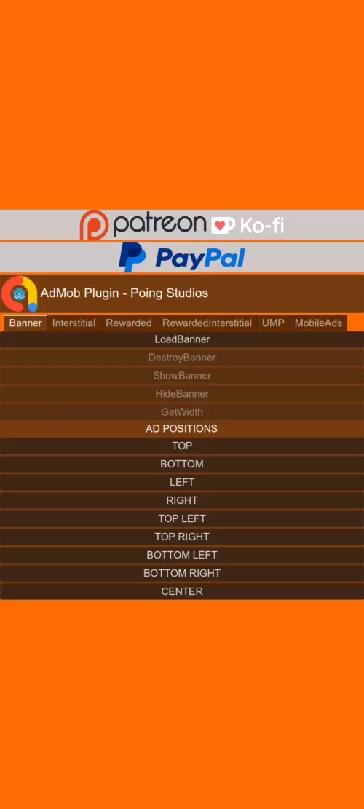

<h1 align="center">
  <br>
  
  <br>
  Godot AdMob Android
  <br>
</h1>

<h4 align="center">A Godot's plugin for Android of <a href="https://admob.google.com" target="_blank">AdMob</a>.</h4>

<p align="center">
  <a href="https://github.com/poingstudios/godot-admob-android/releases">
    
  </a>
  <a href="https://github.com/poingstudios/godot-admob-android/actions/workflows/release_android.yml">
    
  </a>
  <a href="https://github.com/poingstudios/godot-admob-android/releases">
    
  </a>
  
  
</p>

<p align="center">
  <a href="#❓-about">About</a> •
  <a href="#🙋‍♂️how-to-use">How to use</a> •
  <a href="#📄documentation">Docs</a> •
  <a href="https://github.com/poingstudios/godot-admob-android/releases">Downloads</a> 
</p>

     
## ❓ About 



This repository is for a _Godot Engine Plugin_ that allows showing the ads offered by **AdMob** in an **easy** way, without worrying about the building or version, **just download and use**.

The **purpose** of this plugin is to always keep **up to date with Godot**, supporting **ALMOST ALL** versions from v4.1+, and also make the code **compatible** on **Android and [iOS](https://github.com/poingstudios/godot-admob-ios)**, so each advertisement will work **identically on both systems**.

### 🔑 Key features

- It's a wrapper for [Google Mobile Ads SDK](https://developers.google.com/admob/android/sdk). 🎁
- Easy Configuration. 😀
- Supports nearly all Ad Formats: **Banner**, **Interstitial**, **Rewarded**, **Rewarded Interstitial**. 📺
- GDPR Compliance with UMP Support. ✉️
- Targeting Capabilities. 🎯
- Seamless integration with Mediation partners: **AdColony**, **Meta**, **Vungle**. 💰
- CI/CD for streamlined development and deployment. 🔄🚀
- Features a dedicated [Godot Plugin](https://github.com/poingstudios/godot-admob-plugin), reducing the need for extensive coding. 🔌
- There is also an [iOS plugin](https://github.com/poingstudios/godot-admob-ios) available, which has the same behavior. 🍎


## 🙋‍♂️How to use 
- We recommend you to use the [AdMob Plugin](https://github.com/poingstudios/godot-admob-plugin), you can download direcly from [Godot Assets](https://godotengine.org/asset-library/asset/2063).
- After download, we recommend you to read the [README.md](https://github.com/poingstudios/godot-admob-plugin/blob/master/README.md) of the Plugin to know how to use.

## 📦Installing:

### 📥Download
- To get started, download the `poing-godot-admob-android-v{{ your_godot_version }}.zip` file from the [releases tab](https://github.com/Poing-Studios/godot-admob-android/releases). We recommend checking the [supported Godot version](https://github.com/Poing-Studios/godot-admob-versions/blob/master/versions.json) before proceeding. You can also use the [AdMob Plugin](https://github.com/Poing-Studios/godot-admob-plugin) for this step by navigating to `Tools -> AdMob Download Manager -> Android -> LatestVersion`.
- As of Godot 4.2+ the architecture for [Android Plugins](https://docs.godotengine.org/en/stable/tutorials/platform/android/android_plugin.html) has changed and now properly supports `EditorExportPlugin`. That means no more `.gdap` files. Instead, place the directory `google_admob` from `editor_export_plugin` inside your `addons` folder in your Godot project. You can choose your preferred language (C# or GDScript) so both don't need to be added. Then it can be enabled from the export template just like before.
- To get started, download the `poing-godot-admob-android-v{{ your_godot_version }}.zip` file from the [releases tab](https://github.com/poingstudios/godot-admob-android/releases). We recommend checking the [supported Godot version](https://github.com/poingstudios/godot-admob-versions/blob/master/versions.json) before proceeding. You can also use the [AdMob Plugin](https://github.com/poingstudios/godot-admob-plugin) for this step by navigating to `Tools -> AdMob Download Manager -> Android -> LatestVersion`.

### 🧑‍💻Usage
- Video tutorial: https://youtu.be/WpVGn7ZasKM.
- Enable Android Build Template. [Check the tutorial here](https://docs.godotengine.org/en/stable/tutorials/export/android_custom_build.html).
- Inside `poing-godot-admob-android-v{{ your_godot_version }}.zip` you downloaded, you will face some folders like `'ads'`, `'adcolony'`, `'meta'`, `'vungle'`. To AdMob works only `'ads'` is required, but if you want [Mediation](https://support.google.com/admob/answer/13420272?hl=en), you need the other folders.
- Move the content inside the folder which you need into ```res://android/plugins``` directory on your Godot project.
- Add your [AdMob App ID](https://support.google.com/admob/answer/7356431) to your app's ```res://android/build/AndroidManifest.xml``` file by adding a ```<meta-data>``` tag with name ```com.google.android.gms.ads.APPLICATION_ID```, as shown below. If you don't do this then you App will crash on start-up.

``` xml
<!-- Sample AdMob app ID: ca-app-pub-3940256099942544~3347511713 -->
<meta-data
	android:name="com.google.android.gms.ads.APPLICATION_ID"
	android:value="ca-app-pub-xxxxxxxxxxxxxxxx~yyyyyyyyyy"/>
```
- Export the project enabling the `Use Custom Build` and `Ad Mob`, if you have Mediation, also mark `Ad Mob Meta`, `Ad Mob AdColony` etc...


## 📎Useful links:
- 🦾 Godot Plugin: https://github.com/poingstudios/godot-admob-plugin
- 🍏 iOS: https://github.com/poingstudios/godot-admob-ios
- ⏳ Plugin for Godot below v4.1: https://github.com/poingstudios/godot-admob-android/tree/v2

## 📄Documentation
For a complete documentation of this Plugin: [check here](https://poingstudios.github.io/godot-admob-plugin/).

Alternatively, you can check the docs of AdMob itself of [Android](https://developers.google.com/admob/android/quick-start).

## 🙏 Support
If you find our work valuable and would like to support us, consider contributing via these platforms:

[](https://patreon.com/poingstudios)

[](https://ko-fi.com/poingstudios)

[](https://www.paypal.com/donate/?hosted_button_id=EBUVPEGF4BUR8)

Your support helps us continue to improve and maintain this plugin. Thank you for being a part of our community!


## 🆘Getting help
[](https://github.com/poingstudios/godot-admob-android/discussions)
[](https://discord.com/invite/YEPvYjSSMk)


## Development
All scripts must be executed within the project root folder

### Downloading
#### Clear Download & Build Script:
Unix (Linux & MacOS):
```shell
./scripts/unix/clean_build.sh 4.3
```

Windows:
```shell
./scripts/windows/clean_build.ps1 4.3
```

#### Just Download:
Unix (Linux & MacOS):
```shell
./scripts/unix/download_godot.sh 4.3
```

Windows:
```shell
./scripts/windows/download_godot.ps1 4.3
```

### Building, Exporting, Zipping

#### Just Build:
```shell
./gradlew build
```

#### Export files:
```shell
./gradlew exportFiles -PpluginExportPath=D:\godot-admob-editor\android\plugins
```

#### Build and exporting plugin files into the desired directory:
```shell
./gradlew build ; ./gradlew exportFiles -PpluginExportPath=D:\godot-admob-editor\android\plugins
```


#### Zip:
(-PgodotVersion is optional)
```shell
./gradlew zipPlugins -PgodotVersion=4.1.1 
```

### Logging
If you are having some issues with crashing or any expected behavior, you can easily get the log of the plugin with [ADB](https://developer.android.com/tools/adb):

#### Logcat AdMob Plugin & Godot (recommended)
```shell
adb logcat -s poing-godot-admob godot
```

#### Logcat AdMob Plugin
```shell
adb logcat -s poing-godot-admob
```

#### Logcat Godot
```shell
adb logcat -s godot
```


## ⭐ Star History
If you appreciate our work, don't forget to give us a star on GitHub! ⭐


